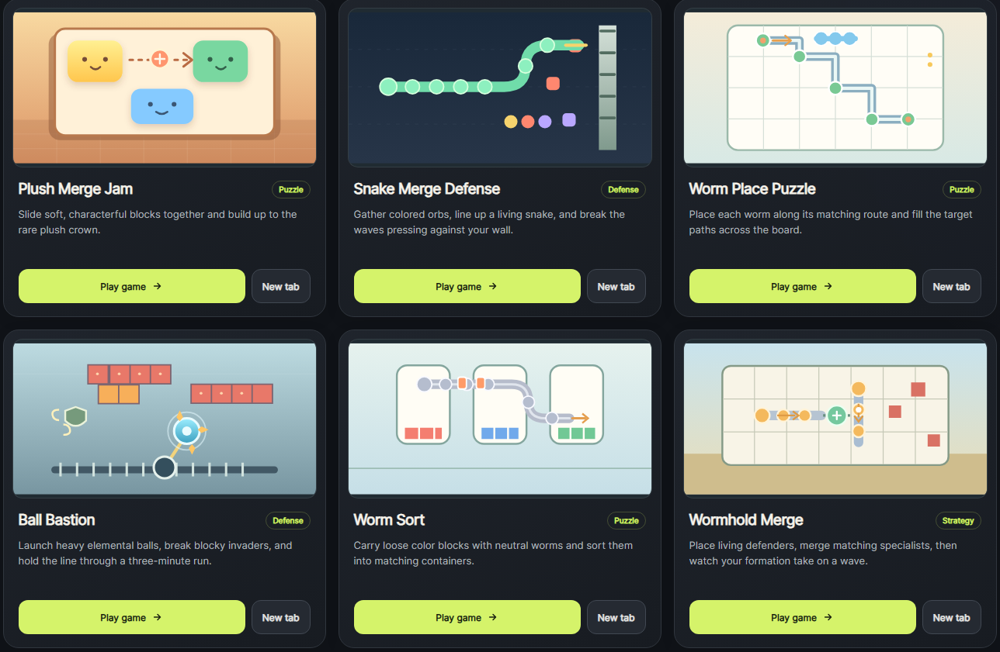

# Mini-Games — AI-Assisted Game Prototypes

A collection of **12 playable mini-game prototypes** across multiple genres. I designed and built these experiments with AI assistance to explore gameplay concepts, core loops, interactions, and rapid iteration.

**[Play the mini-games collection](https://arnmini-game.netlify.app/game_launcher.html)**

## Why I made it

This collection is a hands-on game design playground. I use short prototypes to test ideas quickly, explore different mechanics, and turn concepts into playable experiences rather than relying on design documents alone.

## My contribution

- Game concepts and gameplay design
- Prototyping and iterative testing
- AI-assisted implementation, using ChatGPT and Codex as development tools
- User experience and presentation of the prototype collection

## Play and learn more

- **Play:** https://arnmini-game.netlify.app/game_launcher.html
- **Portfolio:** See my broader game design and production work via my GitHub profile and LinkedIn
- **LinkedIn:** https://www.linkedin.com/in/arsen-arn/

> These are experimental mini-game prototypes, not commercial releases. Their purpose is to demonstrate design exploration and fast AI-assisted prototyping.
